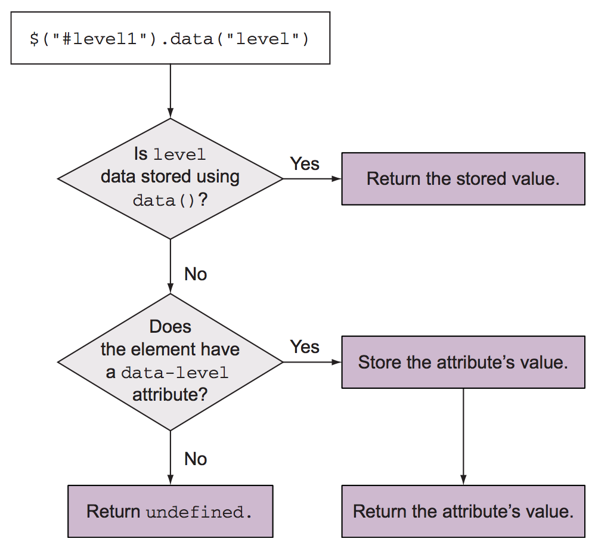

# 4. Working with properties, attributes, and data

* Getting and setting element attributes
* Working with element properties
* Storing custom data on elements

## 4.1 Defining element properties and attributes
_Свойства (properties)_ — в JS-объектах, которые представляют DOM-элементы. Могут быть любого типа.

_Атрибуты (attributes)_ — атрибуты HTML-элемента в разметке. Всегда строки.

Атрибуты хранятся в `HTMLElement.attributes`, свойства — это свойства самого DOM-объекта, или его прототипов (`HTMLElement.className`, `HTMLImageElement.alt`). См. [вызов `showPrototypeChain(img)`](examples/4.1_properties_attributes.html).

Синхронизация значений свойств и атрибутов:

* Происходит в родных (встроенных) атрибутах и свойствах DOM-объекта.
* Не происходит, если родной атрибут в качестве свойства представлен в виде булевого значения (`input[checked]`). Как атрибут он будет `null` или равен значению (как минимум пустой строке). Атрибут не задан — `getAttribute` вернет `null`, а свойство в любом случае вернет `false|true`.
* Не всегда атрибуты равны свойствам, даже если они встроенные и являются строками. Например `src` для картинки: атрибут — как задано в HTML, свойство — абсолютный урл.

Имена свойств и атрибутов могут отличаться. Свойства в родном DOM API всегда в камелКейсе.

Определить, поддерживает ли браузер атрибут в инпуте:

```js
if ('required' in document.createElement('input')) {
    // Attribute supported
}
```

## 4.2 Working with attributes
### 4.2.1 Fetching attribute values
[`attr(name)`](http://api.jquery.com/attr/) — геттер (и сеттер) атрибутов первого элемента в коллекции. Регистронезависимый (по спецификации HTML5).

### 4.2.2 Setting attribute values
`attr(name, value)` — сеттер атрибутов для всей коллекции. `value` — что угодно, что может конвертироваться в строку, в т. ч. функция, которая возвращает значение.

`value` может быть объектом, чтобы стразу установить много атрибутов:

```js
$('input').attr({
    value: '',
    title: 'Please enter a value'
});
```

### 4.2.3 Removing attributes
`removeAttr('name1 name2 ...')` — удалить атрибут(-ы) у выборки. Под капотом используется [`removeAttribute`](https://developer.mozilla.org/ru/docs/Web/API/Element/removeAttribute). Удаляет атрибут, но не удаляет соответствующее ему свойство (просто меняет его значение).

### 4.2.4 Fun with attributes
Пара так себе примеров работы с `attr`.

## 4.3 Manipulating element properties
[`prop`](http://api.jquery.com/prop/) — как `attr`, только для свойств.

`removeProp` — удалить свойство. Удаляет только одно свойство, в отличие от `removeAttr`. Если нативное свойство удалить, то им уже нельзя будет пользоваться, так что надо осторожно. Если удалять, то только кастомные.

`prop` появился после 1.6. Раньше всегда использовали `attr`. Однако, у элементов есть свойства, для которых нет аналогичных атрибутов. Кроме того, некоторые атрибуты и их аналогичные свойства хранят разные значения (`checked`, `src`).

**Атрибут `checked` соотносится со свойством `defaultChecked`, но не со свойством `checked`.** Поэтому атрибут `checked` отвечает только за начальное состояние (то, что в HTML). Для динамической работы с чекбоксами надо использовать `.prop('checked')`.

`checked`, `selected` — это булевы атрибуты по [спецификации HTML](https://www.w3.org/TR/html4/intro/sgmltut.html#h-3.3.4.2). Это значит, что им не обязательно иметь значение. Все примеры сделают чекнутый чекбокс:

```html
<!-- Лучший вариант: -->
<input type="checkbox" checked>

<!-- Это тоже будет работать: -->
<input type="checkbox" checked="checked">
<input type="checkbox" checked="ololo">

<!-- И даже это: -->
<input type="checkbox" checked="false">
```

## 4.4 Storing custom data on elements
Часто нужно хранить данные так, чтобы они были доступны разным скриптам, работающим с элементом. Для этого можно создать глобальные переменные, но это плохой вариант: приложение плохо масштабируется, есть риск переопределить переменные, модульность страдает.

[`data(name, value)`](https://api.jquery.com/jquery.data/) — сеттер, позволяет сохранить любые данные в jQuery-коллекции (в каждом элементе). `name` может быть камелКейсом `someName` или через дефис (`some-name`), разницы не будет.

`data` сохраняет данные в том виде, в котором они передаются. Более того, если в HTML используется `data`-атрибуты с булевыми значениями, он будут интерпретированы как булевы, а не как строки.

```html
<input id="name" name="name" data-mandatory="true" />
<script>
    typeof $('input').data('mandatory') // boolean
    typeof $('input').attr('data-mandatory') // string
</script>
```

`data(object)` — можно передать объект с пачкой имя/значение для установки на элементах коллекции.

`$.data(DOM-element, name, value)` — работает над DOM-коллекциями, не над jQuery-объектами.

`data([name])` — геттер. Покажет данные из первого элемента коллекции по имени. Если имя не передаем (`data()`), по вернет объект со всеми сохраненными данными, которые есть.

Алгоритм работы геттера:

* ищем в объекте атрибут, установленный через сеттер, через jQuery. Если находим, возвращаем значение.
* Если не нашли, то ищем соответствующий HTML data-атрибут. С этих пор jQuery эти данные сохраняет у себя в памяти (как будто бы установили сеттером, а не в HTML) и далее `data-*` атрибут из HTML не учитывает.
* Если ничего не нашли, то возвращаем `undefined`.

Схема:


jQuery 3 хранит ключи data-данных в камелКейсе, раньше хранила как напишешь.

[`removeData()`](https://api.jquery.com/removeData/) — затрагивает только внутренние структуры jQuery, установленные сеттерами или при извлечении `data`-свойств через `$(el).data()`. Не затрагивает HTML-атрибуты. Можно передавать массив или строку.

**При удалении элемента из DOM jQuery сама почистит данные, созданные через `data()`**.

Есть так же `$.removeData()`, которая принимает DOM-элементы.

`$.hasData(element)` – проверяет, имеется ли в DOM-элементе какие-то сохраненные данные через jQuery.

## Вопросы и задания
### Опишите особенности DOM-свойств и атрибутов HTML
* Чем отличаются свойства и атрибуты элементов?
* Как они синхронизируются между собой (строки, булевы значения, цифры)?
* Каковы особенности именования атрибутов и соответствующих им свойств?
* Приведите примеры, когда нужно работать с атрибутами, а когда со свойствами?

### Что будет и почему

```html

<script>
    var img = document.getElementById('myPic');

    // Что будет и почему?
    console.log(img.src == img.getAttribute('src'));
</script>
```

### Определите поддержку HTML5-атрибута
Как определить, поддерживает ли браузер атрибут `draggable` у элементов?

## 4.2 Working with attributes

### Добавить `alt` для картинок
Добавьте картинкам атрибут `alt` на основании названия файла:

* замените `-` на пробел;
* первое слово должно начинаться с большой буквы

Пример:  `../big-fish.jpg` → `Big fish`.

Картинок может быть произвольное количество, путь к картинкам может быть любой. Существующие альты трогать не нужно.

[Шаблон](tasks/img-alt-title/index.html) для задачи.

## 4.3 Manipulating element properties
Как чекнуть чекбокс из JS? Как узнать, чекнут ли чекбокс?

### Работа с атрибутом/свойством `checked`

```html
<input type="checkbox" checked id="myCheckBox">
<script>
    var $cb = $('#myCheckBox');
    
    console.log($cb.prop('checked'), $cb.attr('checked'));

    $cb.prop('checked', false);

    // Что будет и почему? 
    console.log($cb.prop('checked'), $cb.attr('checked'));
</script>
```

## 4.4 Storing custom data on elements
### Вопросы
* Какие данные можно сохранять в `data-*` атрибутах?
* Как jQuery сохраняет и достает данные с помощью `.data()`? Опишите алгоритм работы.
* Чем отличаются `$.data` и `$.fn.data`?
* Как удалить данные, сохраненные в элементе через `.data()`?
* Как проверить, имеет ли элемент данные, сохраненные через `.data()`?

### Что будет и почему

```html
<input type="checkbox" data-url="http://ya.ru" id="myCheckBox">
<script>
    var $cb = $('#myCheckBox');

    $cb.data('url', 'http://google.com');

    // Что будет и почему?
    console.log($cb.data('url') == $cb.attr('data-url'));

    $cb.removeData('url');

    // Что будет и почему?
    console.log($cb.attr('data-url'));
</script>
```
