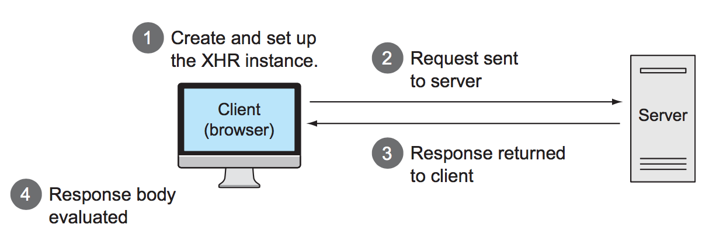

# 10. Talk to the server with Ajax
* A brief overview of Ajax
* Loading preformatted HTML from the server   Making GET and POST requests
* Exerting fine-grained control over requests
* Setting default Ajax properties
* Handling Ajax events

:::warning Синтаксис
В коде проектов используйте полный синтаксис [`$.ajax`](https://learn.jquery.com/ajax/jquery-ajax-methods/) вместо сокращений `$.get()`, `$.post()` и `.load()` пр. Во-первых, код будет однообразный, во-вторых удобно изменять/добавлять свойства и методы и в третьих, практически всегда сокращений не достаточно для определения всех параметров запроса.
:::

Термин Ajax (for Asynchronous JavaScript and XML) предложил Jesse James Garrett из Adaptive Path в 2005-м году.

## 10.1 Brushing up on Ajax
Аяксовый запрос использует конструктор `XMLHttpRequest` (XHR) или Microsoft XMLHTTP ActiveX control под капотом. Такие запросы позволяют отправлять и получать информацию с сервера без перезагрузки страницы.



Спецификация XHR: https://xhr.spec.whatwg.org

Перед тем, как послать запрос, нужно сделать вот что:
1. Specify the HTTP method (such as POST or GET).
2. Provide the URL of the server-side resource to be contacted.
3. Let the XHR instance know how it can inform you of its progress.
4. Provide any body content for requests such as POST.

Хоть в Ajax буква 'X' значит XML, ответ может быть в любом формате: текст, HTML, JSON, XML, ...

Нативный аякс требует:
* Специфического кода для старых браузеров
* Нужно отсеивать стейты запроса
* Нужно обрабатывать ответ в соответствии с его MIME-типом

## 10.2 Loading content into elements
### 10.2.1 Loading content with jQuery
Загрузить кусок HTML с сервера в див можно методом [`load`](http://api.jquery.com/load/):

```js
$('#elem').load('some-resource');
```

`load` вернет коллекцию, можно чейнить (сработает сразу, не будет дожидаться ответа, см. `load_chaining.html`).

`load(url[, data][, callback])` — если `data` задана объектом, то пошлется POST. Если на задать, будет GET. Если надо задать параметры и послать GET, нужно его декодировать в строку (использовать `$.param` или `encodeURIComponent()`)

В колбэк приходит 3 параметр: `responseText, status, jqXHR`. `jqXHR` — расширенный объект XHR (jQuery добавляет свои методы и свойства). Например, можно взять контент-тайп: `jqXHR.getResponseHeader('Content-Type')`.

Можно даже делать так: `.load('data.html p:last-of-type', loadCb)`. Вставится только последний из абзацев.

#### Сериализация/десериализация форм
[`$('#selector').serialize()`](https://api.jquery.com/serialize/) — формирует строку запроса из jQuery-коллекции. Метод сам находит элементы форм в коллекции и выбирает только те элементы, которые по [спецификации](https://www.w3.org/TR/html401/interact/forms.html#h-17.13.2) считаются пригодными для сабмита (пустые селекты, невыделенные кнопки и радиобаттоны, элементы без имени игнорируются).

Есть и обратный процесс — десериализация. Ее jQuery из коробки не делает, но есть [хороший плагин](https://github.com/kflorence/jquery-deserialize). Десериализация может быть полезна, когда мы заходим по урлу и надо взять оттуда гет-параметры и вставить их в форму. Например, в форму поиска.

[`serializeArray()`](https://api.jquery.com/serializeArray/) вместо строки запроса вернет сериализованные данные в виде массива объектов `[{name:value}, ...]`.

### 10.2.2 Loading dynamic HTML fragments
[Пример `chapter-10/phase.1.html`](https://github.com/AurelioDeRosa/jquery-in-action/blob/master/chapter-10/phase.1.html) с загрузкой куска HTML в репозитории книги.

## 10.3 Making GET and POST requests
В основном используются GET и POST запросы:
* `GET` — когда операция ничего не меняет. Каждый раз придет одно и то же, [идемпотентность](http://www.restapitutorial.ru/lessons/idempotency.html). Браузеры кешируют гет-запросы.
* `POST` — когда что-то нужно изменить: удалить, записать, отредактировать. Не идемпотентная операция.

### 10.3.1 Getting data with GET
`$.get(url[, data][, callback][, dataType])` — пошлет гет-запрос при `data` в любом виде (в отличие от `load`, который посылает POST, если отдать массив/объект). `dataType` говорит, как нужно интерпретировать ответ: html, text, xml, json, script или jsonp. Вернет `jqXHR` инстанс.

Никуда ничего не вставит, нужно самим вставлять ответ в DOM в колбэке, если нужно.

В jQuery 3.x добавилась новая сигнатура: `$.get([options])`.

### 10.3.2 Getting JSON data
`$.getJSON()` — для случаев, когда известно, что придет JSON. Сама распарсит и сделает его JS-данными в колбэке.

Как если бы послали `$.get()` с `dataType` `json`.

### 10.3.3 Dynamically loading script
`$.getScript()` — когда нужно динамически подгрузить скрипт и вставить его на страницу. Тут URL не обязательно должен быть с того же домена. Под капотом так:

```js
getScript: function( url, callback ) {
    return jQuery.get( url, undefined, callback, "script" ); // без `data`, `dataType` указан как `script`
}
```

Скрипт загружается, исполняется и переменные/функции становятся доступны.

### 10.3.4 Making POST requests
Когда POST:
* Нужно изменить данные, а не просто получить
* Нужно отправить много байтов (картинку)
* Сервер реагирует по-разному на GET и POST
* ...

`$.post()` — как гет, только передает данные постом.

### 10.3.5 Implementing cascading dropdowns
Интересно про отлавливание события на родительском элементе при всплытии.

Есть 3 селекта. На изменение каждого нужно выполнять какое-то действие. Как это лучше сделать? Можно использовать то, что событие всплывает и навесить `change` на элемент, в котором эти 3 селекта находятся. Будет всплытие и там все сделается. См. страницу 287 в книге.

Пример. На изменение нужно `<option value="">-choodse smth-</option>` — пустое `value` с текстом заглушкой. Вешаем обработчик на родительский див:

```js
$('#selections-pane').change(function(event){
   $('[value=""]', event.target).remove(); // среди всех дочерних селектов найти пустые опшены
});
```

## 10.4 Taking full control of an Ajax request
Когда может быть плезен `$.ajax`:
* Сказать серверу, что не нужно отдавать из кэша браузера
* Можно послать запрос и ждать ответ только определенное время
* Если получили ответ в одном формате (текст, например), но хотим с ним работать как с html или xml.
* ...

### 10.4.1 Making Ajax requests with all the trimmings
`$.ajax(url[, options])`, `$.ajax([options])` — `url` можно указывать отдельно, а можно прямо в опциях. Возвращает `jqXHR`-объект.

`dataType` — тип данных, которые мы ожидаем получить. Определяет, надо ли как-то обработать полученные данные перед передачей в колбэк.

`context` — задать `this` для функции-обработчика. По-умолчанию — объект опций.

[Полный список опций](http://api.jquery.com/jQuery.ajax/). Страница 290 в книге.

### 10.4.2 Setting request defaults
`$.ajaxSetup()` — установить опции всех аяксовых запросов из jQuery по умолчанию. Не для установки обработчиков для done, error, always. Не действует на `.load()`, не переопределяет методы для `$.get` и `$.post`.

Свойства по умолчанию можно переопределять в конкретных вызовах.

### 10.4.3 Handling Ajax events
Есть ряд кастомных событий, с помощью которых можно обрабатывать аяксовые запросы.

* Локальные: `beforeSend`, `done`, `fail`, `alway` — обрабатываются колбэками. Это колбэки в конкретных вызовах `$.ajax`.
* [Глобальные](https://api.jquery.com/category/ajax/global-ajax-event-handlers/): события для всех аяксовых запросов: `ajaxStart`, `ajaxSend`, `ajaxSuccess`, `ajaxError`, `ajaxStop` и `ajaxComplete`. Это кастомные события, которые триггерятся на `document` и на них можно подписаться и обработать.

Глобальные события вешаются на `document`, как обычные события: `$(document).on('ajaxStart)`.

Помимо навешивания обработчиков на события `document`, есть интерфейс через функции:

```
ajaxComplete(callback)
ajaxError(callback)
ajaxSend(callback)
ajaxStart(callback)
ajaxStop(callback)
ajaxSuccess(callback)
```

jQuery отслеживает количество активных запросов (`jQuery.active`). Так, если запустить пачку аяксов, то `ajaxStart` и `ajaxStop` не сработают для каждого, а будут до и после передачи данных. См. пример в `book-repo/chapter-10/ajax.events.html` и код jQuery 3.0 в строках `9027` и `9262`

### 10.4.4 Advanced Ajax utility functions
Продвинутые методы, редко понадобятся, но они есть.

`$.ajaxPrefilter([dataTypes,] callback)` — позволяет обработать аяксовые опции перед отправкой. Можно зарубить запрос, можно перенаправить, изменить дата `dataType`. См. пример в `book-repo/chapter-10/$.ajaxPrefilter.html`.

`$.ajaxTransport([dataType,] callback)` — позволяет изменить внутреннюю кухню `$.ajax`. Должен вернуть объект с методами `send` и `abort` (внутренний транспортный объект jQuery). Каждый запрос имеет свой собственный транспортный объект, поэтому напрямую мы его вернуть не можем, можем только подменить методы. Использовать нужно в случае крайней необходимости.

## Вопросы и задания

### Прочитать и попробовать
* [JSONP](https://learn.javascript.ru/ajax-jsonp)
* [Same origin policy](https://en.wikipedia.org/wiki/Same-origin_policy)
* [CORS](https://medium.com/statuscode/cors-a-guided-tour-4e72230a8739)
* [`fetch`](https://learn.javascript.ru/fetch).

### Задача
Реализовать [компонент с выбором региона и города](https://github.com/amiskov/homeworks/tree/master/city-selector).
